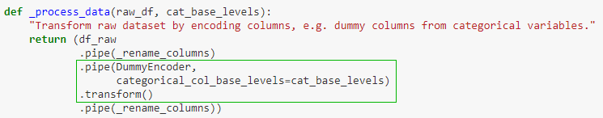
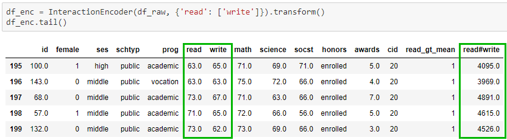
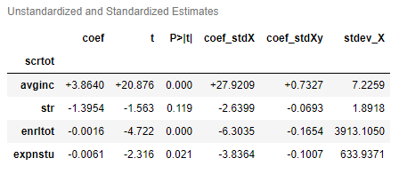

**These are some reasons why Appelpy adds _so much more_ to the vanilla Python data stack:**
## General principles
- **Fluent interface** and API design make it easier to build pipelines for modelling & data pre-processing.
- Appelpy is a more accessible Python library for Stata users, by having a simple syntax and having most functionality rely on a fitted model object, while realising the benefits of object-oriented programming.

: click the badge to see a demonstration of model pipelines with Appelpy.

## Data transformation
- **Useful encoders** for transforming datasets, e.g.:
    - `DummyEncoder`: encode dummy columns from variables based on different policies for handling NaN values.
    - `InteractionEncoder`: encode columns (in a batch) for the interaction effect between two variables.
- `get_dataframe_columns_diff` method makes it easier to compare the columns between two dataframes when building pipelines for transforming data.

## Exploratory data analysis (EDA)
- One method to examine all `statistical_moments` in a dataset: mean, variance, skewness and kurtosis.
- Correlation heatmap plot with triangular matrix to maximise the data–ink ratio.

## Model estimation
**Model objects take on a special importance in Appelpy**.  More attributes and methods are available through these model objects.  These are examples of what model objects contain:

- Standardized model estimates (Beta coefficients): `model.results_output_standardized`.
- Standardized `y` and `X` values.
- Access the main metrics of a model via `model.model_selection_stats`, e.g. Root MSE for OLS models.
- Odds ratio available for `Logit` models.

## Model diagnostics
It's easy enough to fit a model in Statsmodels.  Where Appelpy shines is the ability to do diagnostics using only the model object, instead of having to call multiple methods scattered across a library.  These are some diagnostics available:

- One method for calling **diagnostic plots** to assess whether OLS assumptions hold in a model, e.g. `model.diagnostic_plot('rvf_plot')`.  The plots are similar to commands available in Stata, but here they are accessible within the Appelpy OLS model object.
- `BadApples` class does a decomposition of influence analysis into three parts: leverage, outlier and influence measures.  The leverage vs residuals squared plot (similar to Stata's `lvr2plot`) can also be called from an instance of the class.
- Identify extreme observations in a model based on common heuristics.
- Perform diagnostics not implemented in the main Python libraries, e.g. studentized Breusch–Pagan test of heteroskedasticity.
- Joint hypothesis testing, using built-in Python data structures (lists & dicts).

## Model usage
- Model prediction methods have the option to return predictions only for observations that are 'within sample'.
