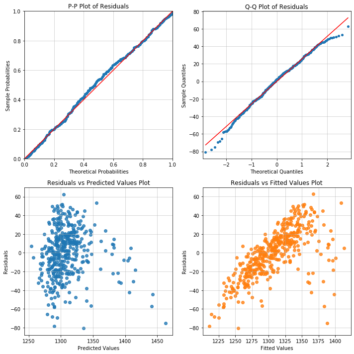

<header>
<pre><p style="font-size:28px;"><b>linear_model</b></p></pre>
</header>

# Overview
There are two classes for linear models:

- Weighted Least Squares (WLS)
- Ordinary Least Squares (OLS)

**OLS** is the core model class in Appelpy.  Many of the model diagnostics available are built for OLS models.

The classes are built upon Statsmodels.  Features that are available in Appelpy include standardized estimates for models.

# Fit a model
The **10 Minutes To Appelpy** notebook fits an **OLS** model to the California Test Score dataset.

- [](https://mybinder.org/v2/gh/mfarragher/appelpy-examples/master?filepath=00_ten-minutes-to-appelpy.ipynb): interactive experience of the *10 Minutes to Appelpy* tutorial via Binder.
- [](https://nbviewer.jupyter.org/github/mfarragher/appelpy-examples/blob/master/00_ten-minutes-to-appelpy.ipynb): static render of the *10 Minutes to Appelpy* notebook.

```python
from appelpy.linear_model import OLS
model1 = OLS(df, y_list, X_list).fit()
model1.results_output  # returns summary results
```

The **`fit` method must be called** in order to set attributes for the model object.

There are three **important parameters** for initialising any model class in Appelpy:

- `df`: the dataframe to use for modelling.  This must have no NaN values, no infinite values, etc.
- `y_list`: a list with the dependent variable column name.
- `X_list`: a list of column names for independent variables (regressors).

Other keyword arguments can be used when initialising the model class, e.g. `cov_type` to specify the type of standard errors in the model.

## Attributes
Here are some attributes available for linear models:

- `y` and `X`: the dataframes of the dependent and independent variables.
- `y_standardized` and `X_standardized`: the standardized versions of `y` and `X`.
- `results_output` for the Statsmodels summary of the model.  Note: the Statsmodels results object is also stored in the `results` attribute.
- `results_output_standardized` for the standardized estimates of the model.
- `model_selection_stats`: dictionary of key statistics on the model fit, including the root mean square error (root MSE).
- The model residuals `resid` and their standardized form `resid_standardized`.

## Methods
For all linear model classes there is a `significant_regressors` method that returns a list of the significant independent variables of a model, given a significance level *alpha*.

Use `fit` to fit a model.

Pass a Numpy array to a `predict` call in order to make predictions given a model.  The method considers whether the regressors values passed to the method are 'within sample' before returning predictions.  By default, predictions are only returned if all the regressor values are 'within sample'.

### Diagnostic plot method
There is also a convenient `diagnostic_plot` method that consumes an OLS model object, in order to return plots such as:

- P-P plot (`pp_plot`)
- Q-Q plot (`qq_plot`)
- Residuals vs fitted values plot (`rvf_plot`)
- Residuals vs predictor values plot (`rvp_plot`)

Here is a useful recipe for producing a 2x2 grid of diagnostic plots with Matplotlib:
```python
fig, axarr = plt.subplots(2, 2, figsize=(10, 10))
model.diagnostic_plot('pp_plot', ax=axarr[0][0])
model.diagnostic_plot('qq_plot', ax=axarr[1][0])
model.diagnostic_plot('rvf_plot', ax=axarr[1][1])
axarr[0, 1].axis('off')
plt.tight_layout()
```


